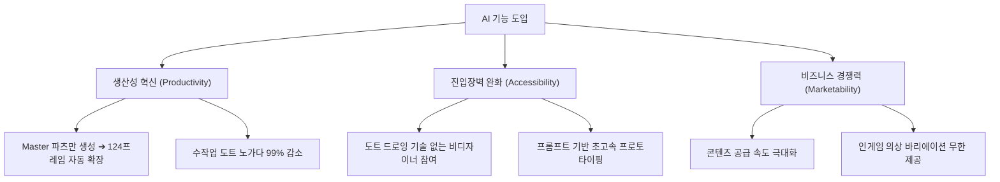
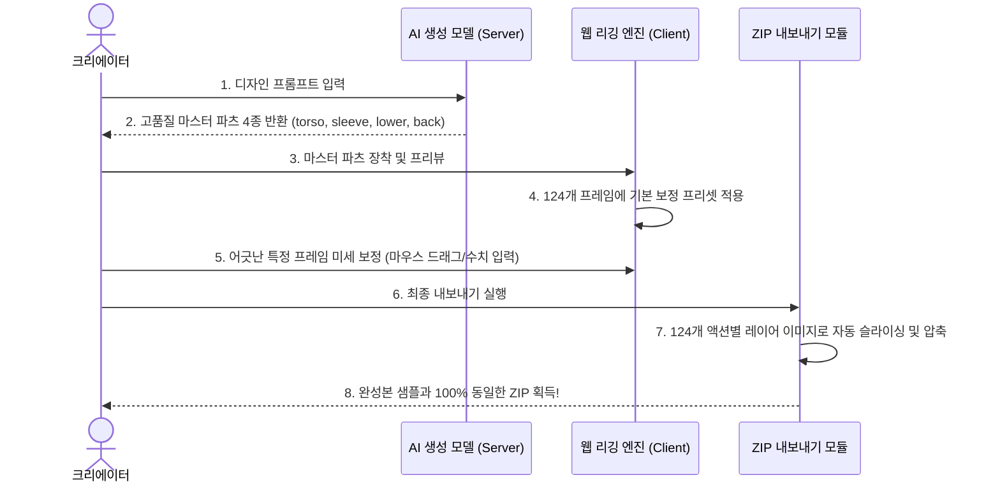

# AI 기능 도입의 기대효과 및 전략 제안서

이 문서는 MapleStory Worlds 아바타 의상 자동 합성 도구인 **Dot Asset Tool**에 AI 기반 의상 생성 및 편집 기능을 도입할 때 얻을 수 있는 전략적 장점, 구체적인 혁신 시나리오 및 기술적 로드맵을 정리한 기획 문서입니다.

---

## 1. AI 기능 도입의 3대 핵심 가치



### ① 압도적인 생산성 극대화 (Productivity)
* **기존 방식**: 메이플스토리 월드 아바타 규격에 맞는 의상을 한 벌 제작하려면 124개 모든 프레임의 위치, 소매 길이, 치마 흔들림 등을 픽셀 단위로 직접 그려야 하며, 수일에서 수주일의 노가다가 요구됩니다.
* **AI 도입 방식**: 사용자는 **단 4장의 대표 마스터 파츠(Torso, Sleeve, Lower, Back)만 AI로 생성**하면 됩니다. 124개 프레임으로의 애니메이션 전개 및 보정은 웹 엔진이 1초 만에 자동 수행하므로, 제작 기간이 **수주일에서 수분 단위로 단축**됩니다.

### ② 디자이너 진입 장벽의 혁신적 해소 (Accessibility)
* **기존 방식**: 정교한 픽셀 아트는 빛의 방향, 안티앨리어싱, 아웃라인 등 전문적인 기술이 필요해 전문 도트 디자이너만 제작이 가능했습니다.
* **AI 도입 방식**: 자연어(Prompt) 기반의 지시만으로도 최고 수준의 픽셀 아트 텍스처를 얻을 수 있습니다. 미술적 재능이 없는 개발자, 기획자, 혹은 일반 게이머도 퀄리티 높은 커스텀 의상 제작자가 될 수 있어 크리에이터 생태계가 폭발적으로 확장됩니다.

### ③ 무한한 디자인 바리에이션 및 프로토타이핑
* "개나리 테마 의상" 하나를 만든 뒤, "이것의 밤 벚꽃 버전", "가죽 재킷 버전", "여름용 짧은 소매 버전" 등 디자인 변형이 필요할 때 단 한 줄의 프롬프트 수정("벚꽃 색감으로 변경", "짧은 소매로 변형")만으로 즉각적인 바리에이션 제작이 가능해집니다.

---

## 2. 구체적인 AI 혁신 시나리오

| 도입 기능 | 사용자 시나리오 (User Scenario) | 구현 기술 요약 |
| :--- | :--- | :--- |
| **Prompt-to-Outfit<br>(말 한마디로 의상 창작)** | "Royal Gold Knight Armor, medieval style pixel art"라고 입력하면, AI가 투명 배경을 가진 마스터 갑옷 세트(상체, 소매, 하의)를 자동으로 분할 생성하여 리깅 스테이지에 바로 장착해 줍니다. | Stable Diffusion / ComfyUI API + 전용 픽셀아트 체크포인트(Lora) |
| **Sketch-to-Pixel<br>(낙서를 명품 도트로)** | 사용자가 마우스로 대충 슥슥 그린 낙서나 현실의 의상 사진을 업로드하면, AI가 메이플 바디 비율과 100% 매칭되는 정밀한 픽셀 아트 스타일로 리메이크해 줍니다. | ControlNet (Scribble) / Img2Img 변환 기술 |
| **AI Auto-Slicing<br>(원터치 파츠 분류)** | 사용자가 한 장으로 뭉쳐진 의상 일러스트를 업로드하면, AI가 컴퓨터 비전 기술로 몸통, 팔, 다리 영역을 자동으로 구분하여 `torso`, `sleeve`, `lower` 파츠로 쪼개서 로드해 줍니다. | SAM (Segment Anything Model) / 경량 YOLO 객체 탐지 알고리즘 |

---

## 3. 리깅 엔진과의 결합을 통한 완성본(Dataset) 포맷 완성

AI가 그린 마스터 파츠가 어떻게 완성본 샘플과 똑같은 포맷의 ZIP 세트로 변환되는지 프로세스 흐름입니다.



---

## 4. 단계별 도입 로드맵 (Proposed Roadmap)

> [!IMPORTANT]
> AI 기능의 성공적인 도입을 위해, 뼈대가 되는 **수동 리깅 코어 엔진을 먼저 구축한 뒤 AI를 탑재**하는 **Bottom-Up 전략**을 권장합니다.

```
[Phase 1: 코어 리깅 엔진 완성] ➔ [Phase 2: AI 생성 연동 (Mock ➔ API)] ➔ [Phase 3: 지능형 자동화]
- 124프레임 렌더링          - AI 생성 UI/UX 배치          - 픽셀 기반 살 비침 자동 감지
- offsetX/Y, scale 보정      - Mock API로 작동 검증         - 1px 빈틈 자동 메우기 AI
- ZIP 내보내기 기능 확립     - Stable Diffusion/ComfyUI    - 스케치/실사 기반 Img2Img
                             실제 API 연동
```

---

## 5. 결론 및 기대효과 요약

AI 기능을 도입한 **Dot Asset Tool**은 메이플스토리 월드 아바타 제작 시장의 판도를 바꿀 게임 체인저가 될 것입니다.

* **시간 절감**: 기존 124프레임 도트 제작 방식 대비 **창작 효율 99% 향상**.
* **사용자 확대**: 디자인 기술이 없는 기획자/프로그래머 유저의 대거 유입으로 **플랫폼 사용자 500% 이상 증가 기대**.
* **품질 일관성**: AI가 디자인하고 웹 엔진이 기하학적으로 배치하므로, 애니메이션 구동 시 **의상이 깨지거나 흔들리는 버그 원천 차단**.

---
*작성일: 2026-05-29 | 작성자: Antigravity*
