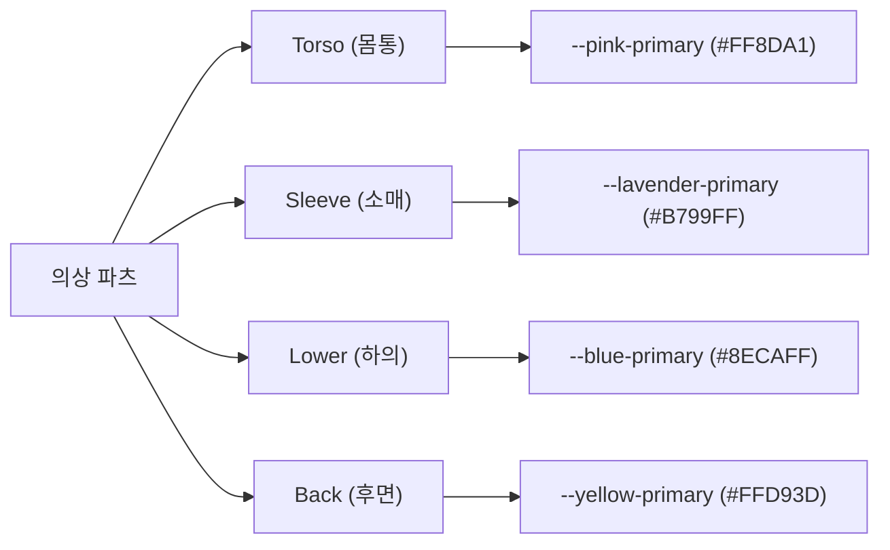
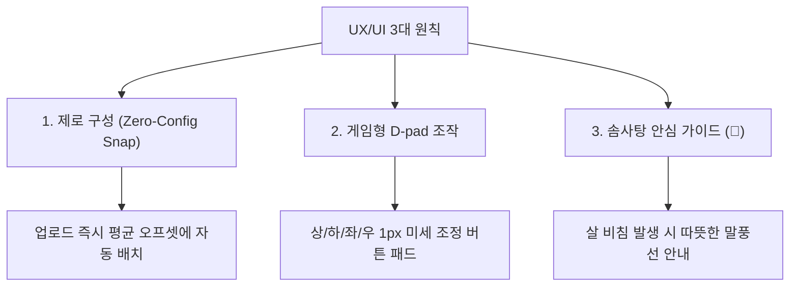

# 아기자기한 파스텔톤 초보자 중심 디자인 가이드 (Design Direction)

본 문서는 **Dot Asset Tool**의 브랜드 정체성인 **"산리오 스타일의 아기자기한 파스텔톤 감성 (Sanrio Pastel Vibe)"**을 유지하면서, 초보자 크리에이터가 복잡한 리깅 과정을 인형 옷 입히기 게임처럼 쉽고 재미있게 느낄 수 있도록 돕는 UI/UX 가이드라인 및 디자인 방향성을 규정합니다.

---

## 1. 디자인 컨셉 및 아이덴티티

```text
       [아기자기함 (Cute)] ➔ 장난감이나 인형 옷 입히기 게임을 하는 듯한 레이아웃
               +
  [파스텔톤 감성 (Soft Pastel)] ➔ 피로감을 주지 않고 감성을 자극하는 색조
               +
    [쉬운 난이도 (Simple UX)] ➔ 복잡한 수치 대신 직관적인 도구와 자동화
```

* **핵심 가치**: "복잡한 아바타 제작 도구를 귀여운 장난감 완구로 바꾼다."
* **목표**: 리깅 작업이 단순한 '개발/코딩'의 영역이 아니라, **'아기자기한 캐릭터 스타일링'** 과정으로 느껴지게 만드는 것.

---

## 2. 디자인 토큰 및 가시성 시스템 (Color & Typography)

`src/index.css`에 구축된 최고 품질의 파스텔 컬러 시스템과 서체를 100% 활용하여 화면의 일관성을 확보합니다.

### ① 파츠별 고유 테마 컬러 매핑 (Part Color System)
글자를 일일이 읽지 않아도 파츠의 상태를 인지할 수 있도록 고유 파스텔 컬러를 부여하고 화면 전체에 일치시킵니다.



* **적용 사례**: 
  * 파츠 업로드 카드 테두리 및 아이콘 색상
  * 조절 패널 내 해당 파츠 슬라이더 및 버튼 색상
  * **캔버스 내 가이드 점선(Guide Border)**: 현재 선택되어 조절 중인 파츠의 영역을 해당 고유 컬러의 2px 점선으로 표시하여 작업 대상이 직관적으로 보이게 함.

### ② 서체 및 계층 구조 (Typography)
* **헤드라인 (Comfortaa)**: 둥글둥글하고 기분 좋은 느낌을 주는 Comfortaa 서체를 로고, 타이틀, 스텝 상태 배지에 사용해 장난감 완구 패키지 같은 느낌을 줍니다.
* **본문 및 수치 (Quicksand)**: 가독성이 뛰어난 둥근 고딕체 계열인 Quicksand를 사용해 긴 텍스트와 보정 숫자의 가독성을 보완합니다.
* **글자 색상**: 강하고 차가운 검정색 대신, 부드러운 다크 차콜 보라색(`--text-primary: #4A3E4D`)을 사용하여 눈의 피로를 최소화하고 따뜻한 느낌을 제공합니다.

---

## 3. 초보자를 위한 3대 UX/UI 설계 원칙



### ① 제로 구성 스냅 (Zero-Configuration Snapping)
* **가이드라인**: 사용자가 마스터 파츠 이미지를 처음 올렸을 때, 조절값이 `(0, 0)`으로 세팅되어 캐릭터 몸에서 완전히 벗어나 허공에 뜨는 것을 방지합니다.
* **적용 방식**:
  * 완성본 샘플 데이터를 기반으로 한 **"기본 권장 오프셋 값(평균값)"**을 앱 백엔드 데이터에 기본 세팅해 둡니다.
  * 이미지가 업로드되는 즉시 자동으로 스냅되어 캐릭터 가슴, 팔 위치에 **95% 딱 맞게 배치**된 채 시작됩니다. 유저는 1~2px의 미세 조정만 하면 됩니다.

### ② 게임형 미세조정 D-Pad 패널
* **가이드라인**: 숫자를 직접 입력하거나 슬라이더를 1단위로 정밀하게 드래그하는 작업은 마우스 조작이 미숙한 유저에게 매우 큰 불쾌감을 줍니다.
* **적용 방식**:
  * 조절 패널 중앙에 아기자기한 **게임 콘솔 십자키(D-pad) 형태의 1픽셀 이동 버튼 패드**를 제공합니다.
  * 상, 하, 좌, 우 방향키를 꾹꾹 누르며 도트 픽셀을 한 칸씩 맞추는 재미를 주어 조작을 게임화(Gamification)합니다.
  * 스케일 조절 역시 둥글고 귀여운 `+`, `-` 버튼을 누르는 단순 동작으로 직관화합니다.

### ③ 🧸 솜사탕 안심 가이드 (Friendly Alert & Soft Warnings)
* **가이드라인**: 맨살이 튀어나오는 등 합성 불량이 생겼을 때 경고음이나 새빨간 에러 문구로 위압감을 주지 않습니다.
* **적용 방식**:
  * 에러 알림바는 부드러운 파스텔 옐로우와 베이지 색감을 기반으로 만듭니다.
  * 귀여운 곰돌이 아이콘(`🧸`)과 함께 **"앗! 캐릭터의 예쁜 맨살이 살짝 비치고 있어요! 옷을 1픽셀만 아래로 내려볼까요?"**와 같은 친절하고 둥근 대화체 피드백을 제공합니다.

---

## 4. 시각 디자인 특징 (Visuals & Motion)

### ① 둥근 모서리와 푹신한 그림자 (Card Design)
* **둥근 모서리**: 아바타 툴의 전 영역은 최소 10px에서 최대 24px의 둥글둥글한 모서리(`--radius-lg: 24px`)로 설계되어, 뾰족하고 위협적인 느낌을 완전히 배제합니다.
* **푹신한 입체감 (Glow & Soft Shadow)**:
  * 버튼이나 카드가 활성화되었을 때, 핑크색과 보라색 광원 효과가 부드럽게 나타나는 그림자(`--pink-glow`, `--lavender-glow`)를 적용해 포근한 느낌을 줍니다.

### ② 미세 애니메이션 (Micro-Animations)
* **스텝 활성화 펄스 효과**: 진행 단계 배지(`.step-badge`)에 구현된 것처럼, 현재 작업 중인 스텝은 핑크빛 점이 부드럽게 뛰는 펄스(`pulse 1.5s infinite`) 애니메이션을 부여해 생동감을 줍니다.
* **바운스 클릭 피드백 (Hover & Active)**: 
  * 버튼 위에 마우스를 올리거나 누를 때 젤리처럼 부드럽게 수축했다가 통통 튀며 복원되는 **Elastic Hover 효과**를 CSS transition으로 구현합니다. (예: `transform: scale(1.03)` 및 `cubic-bezier(0.175, 0.885, 0.32, 1.275)` 바운스 곡선 사용)

---

## 5. 단계별 디자인 적용 프로세스

이 가이드라인은 향후 구현될 모든 Step에 다음과 같이 실질적으로 개입합니다.

1. **Step 3 (파츠 업로드 패널)**: 드롭존 카드 디자인 시 4종 고유 컬러 및 점선 테두리 적용.
2. **Step 5 (미세 조절 패널)**: D-pad 컨트롤러 및 미세 조정 스위치 컴포넌트 탑재.
3. **Step 6 (합성 미리보기)**: 선택된 파츠 영역 가이드라인 점선 렌더링.
4. **Step 7 (살 비침 경고)**: 🧸 솜사탕 안심 가이드 디자인 팝업 및 가이드 표시.

---
*작성일: 2026-05-29 | 작성자: Antigravity*
