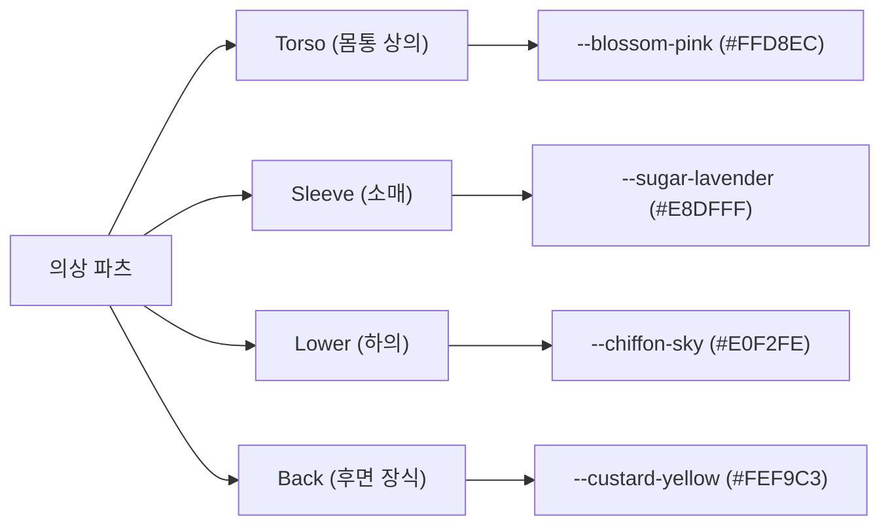

# 🎀 나의 달콤한 의상실: 산리오 파스텔 감성 UI/UX 디자인 가이드라인 (DESIGN_DIRECTION)

본 문서는 **Dot Asset Tool**의 브랜드 정체성인 **"산리오 스타일의 아기자기한 파스텔톤 감성 (Sanrio Pastel Vibe)"**을 구현하고, 복잡한 아바타 의상 리깅 및 후처리 작업을 귀여운 **"인형 옷 입히기 놀이"**처럼 쉽고 재미있게 느낄 수 있도록 돕는 UI/UX 가이드라인 및 디자인 방향성을 규정합니다.

---

## 🧸 1. 디자인 메타포: "달콤한 인형 상자" (Sweet Doll Box)

차가운 격자(Grid), 수치 입력창, 업로드(Upload) 등 기계적인 용어와 차가운 회색 톤의 사각형 UI를 배제하고, 장난감 완구 패키지와 소녀의 방 화장대를 모티브로 레이아웃과 명칭을 전면 재구성합니다.

```
        [아기자기함 (Cute)] ➔ 인형 옷 입히기 완구 완제품을 다루는 듯한 아날로그 레이아웃
                +
   [파스텔톤 감성 (Soft Pastel)] ➔ 피로감을 주지 않고 포근하고 따뜻한 감성을 자극하는 색조
                +
     [쉬운 난이도 (Simple UX)] ➔ 복잡한 기계식 설정 대신 직관적인 도구와 요술 자동화
```

* **핵심 가치**: "복잡한 아바타 머신러닝 개발 도구를 귀여운 요술 완구 상자로 바꾼다."
* **목표**: 의상 리깅 작업이 따분한 '개발/조정'의 영역이 아니라, **'나만의 예쁜 아바타 인형 꾸미기'** 과정으로 100% 전이되게 만드는 것.

---

## 🎨 2. 솜사탕 파스텔 컬러 시스템 (Color Palette)

강한 명도 대비의 검정색이나 메탈릭한 회색, 위협적인 에러 빨간색을 완전히 차단하고, 우유 한 방울을 섞은 듯 부드럽고 푹신한 파스텔톤 컬러와 부드러운 코코아 브라운 텍스트 컬러를 사용합니다.

### ① 파츠별 고유 테마 컬러 매핑 (Part Theme Colors)
글자를 일일이 읽지 않아도 파츠의 상태와 영역을 인지할 수 있도록 고유 파스텔 컬러를 부여하고 화면 전체에 일치시킵니다.



* **기본 텍스트 컬러**: `--cocoa-brown (#5D4B41)`
  * 차갑고 단단한 검은색 대신, 포근한 쿠키 느낌의 다크 초콜릿 브라운 컬러를 사용하여 눈의 피로를 최소화하고 편안함을 극대화합니다.
* **배경 및 베이스 컬러**: `--peach-cream (#FFF3EB)`
  * 피치 크림 컬러와 부드러운 스킨 라벤더 톤을 대각선 방사형 그라데이션으로 매치하여 따뜻하고 포근한 도화지 느낌을 제공합니다.

### ② 둥글둥글 형태 법칙 (Soft Form Rules)
* **모서리 반경 (Radius)**: 모든 카드와 패널의 모서리는 **최소 `20px`에서 최대 `32px`**을 적용하여 날카로운 뾰족한 곳을 배제합니다.
* **바느질 테두리 (Stitch Border)**: 카드 영역의 외곽선은 단순 실선 대신 `3px dashed var(--blossom-pink-dark)`와 같은 점선을 주어, **실제 수공예로 한 땀 한 땀 바느질한 천 모양**의 귀여움을 제공합니다.

---

## 📝 3. 딱딱한 개발자 용어 ➔ "요술 감성 언어" 매핑 다이어리

사용자가 기계를 조작하는 스트레스를 받지 않도록 화면 내의 모든 텍스트 라벨과 도움말 문구를 리네이밍합니다.

| 기존 개발자 용어 | 🎀 요술 감성 변경 언어 | UI 기획 연출 가이드 |
| :--- | :--- | :--- |
| **Grid Template / Base Body** | **🍬 슈크림 인형 바디 (Creamy Doll Body)** | 바디 에셋 영역을 예쁜 파스텔톤 아크릴 피규어 거치대 스탠드로 꾸밈 |
| **Part Upload / Dropzone** | **🎪 요술 서랍장 (Magic Drawer)** | 드래그 오버 시 서랍이 열리는 모션과 귀여운 "쏙!" 효과음 렌더링 |
| **D-Pad Offset Alignment** | **🎀 의상 위치 통통이 (Bouncy Fit)** | 위치 보정 조절 시 도트 옷 레이어가 젤리처럼 통통 튀며 반응 |
| **Body Pixel Subtraction** | **🫧 마법 투명 건조기 (Magic Dryer)** | 픽셀 차감 연산 시 보글보글 거품 이펙트와 함께 몸뚱이 픽셀이 제거됨 |
| **AI Inpainting Prompt** | **💌 솜사탕 재봉틀 (Cotton Candy Sewing)** | 프롬프트 입력창을 귀여운 편지 두루마리 스크롤 스타일로 디자인 |
| **Zip Export** | **🎁 예쁜 옷장 보관함 (Wardrobe Box)** | 파일 다운로드 버튼을 핑크빛 리본이 묶인 선물 포장 에어 배송 상자 형태로 묘사 |

---

## 🔮 4. 초보자를 위한 3대 요술 컴포넌트 설계

### ① 🎪 요술 서랍장 (Magic Drawer - Dropzone Panel)
* **컨셉**: 파스텔톤 핑크와 크림색 서랍장을 형상화한 업로드 패널입니다.
* **작업 방식**:
  * 사용자가 마스터 템플릿 파일이나 이미지를 드래그 앤 드롭하면, 서랍장 서랍 문이 스르륵 열리는 CSS 트랜지션 모션이 연출됩니다.
  * 드롭 즉시 옷걸이(`hanger-icon`)에 옷이 깔끔하게 걸려 서랍 안에 아기자기하게 수납된 모습으로 에셋을 가시화합니다.

### ② 🪄 하트 요술봉 조절기 (Heart Wand Controller - D-pad)
* **컨셉**: 마법 소녀의 요술봉 형태를 띈 위치 조정 D-pad 컨트롤러입니다.
* **작업 방식**:
  * 복잡한 숫자 패널 대신, 큰 핑크빛 하트 보석을 중심으로 4방향 요술 화살표 버튼을 제공합니다.
  * 십자키를 꾹꾹 누르며 도트 픽셀을 한 칸씩 맞출 때마다, 마법봉 끝에서 팡팡 터지는 미세한 별 가루(SVG Particle) 조각들이 캔버스 위에 귀엽게 흩뿌려집니다.

### ③ 🧸 솜사탕 안심 가이드 (Friendly Helper Bear)
* **컨셉**: 우측 하단에 따뜻하게 늘 상주하는 도우미 곰인형 배지입니다.
* **작업 방식**:
  * 마우스를 올릴 때마다 곰돌이가 기분 좋게 갸웃거리며 도움말 말풍선을 띄웁니다.
  * 맨살 비침 등 검수 오류 발생 시 새빨간 에러 메시지를 띄우는 것이 아니라, 곰돌이가 깜짝 놀라는 표정과 함께 **"앗! 인형 친구의 소매 밑으로 맨살이 살짝 삐져나왔어요! 마법 하트 화살표를 아래로 한 번만 꾹 눌러볼까요?"** 하고 친구처럼 안내합니다.

---

## 🌟 5. 생동감을 주는 바운스 & 로딩 애니메이션 (Motion)

### ① 젤리 통통 모션 (Elastic Spring CSS)
버튼을 호버하거나 누를 때 딱딱하게 크기만 변하는 방식 대신, 젤리를 통통 누르는 느낌을 주는 elastic spring 곡선을 적용합니다.
```css
.sweet-btn {
  transition: transform 0.3s cubic-bezier(0.175, 0.885, 0.32, 1.275), 
              box-shadow 0.3s ease;
}
.sweet-btn:hover {
  transform: scale(1.06) translateY(-2px);
  box-shadow: 0 12px 24px -6px rgba(255, 141, 161, 0.4);
}
.sweet-btn:active {
  transform: scale(0.94) translateY(0);
}
```

### ② 솜사탕 둥실둥실 (Floating Cloud Loading)
AI 생성 연산(마법 재봉)이 진행되는 대기 시간 동안 지루한 딱딱한 로딩 바 대신, **핑크색 구름 위에 아바타 인형이 누워 둥실둥실 낮잠을 자고 있는 대기 모션**을 렌더링하여 기다리는 시간조차 힐링 요소로 만듭니다.

---

## 🛠️ 6. 산리오 테마 전용 CSS 변수 설정안
```css
@import url('https://fonts.googleapis.com/css2?family=Comfortaa:wght@400;700&family=Quicksand:wght@500;700&display=swap');

:root {
  /* Soft Pastel Color Palette */
  --blossom-pink: #FFD8EC;
  --blossom-pink-hover: #FFB7DC;
  --blossom-pink-dark: #FF6FA5;
  
  --sugar-lavender: #E8DFFF;
  --sugar-lavender-dark: #9D84FF;
  
  --peach-cream: #FFF3EB;
  --peach-cream-light: #FFFAF6;
  
  --chiffon-sky: #E0F2FE;
  --chiffon-sky-dark: #38BDF8;
  
  --custard-yellow: #FEF9C3;
  --custard-yellow-dark: #FACC15;
  
  --cocoa-brown: #5D4B41;
  --cocoa-brown-light: #8E7A6E;
  
  /* Typography */
  --font-fancy: 'Comfortaa', cursive;
  --font-cozy: 'Quicksand', sans-serif;
  
  /* Radii & Shadows */
  --radius-sweet: 32px;
  --radius-pillow: 20px;
  
  --sweet-shadow: 0 10px 30px -5px rgba(93, 75, 65, 0.08), 
                  0 0 24px -2px rgba(255, 216, 236, 0.3);
  --jelly-glow: 0 0 20px rgba(255, 111, 165, 0.35);
}
```

---
*수정일: 2026-05-30 | 기획 고도화 적용 완료*
