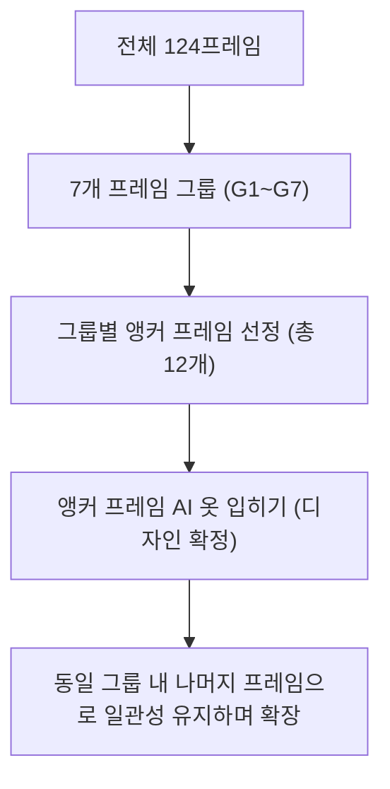

# 🧸 Dot Asset Tool: FRAME_GROUP_PLAN & ANCHOR_FRAME_LIST

본 문서는 MapleStory Worlds(MSW) 아바타의 전체 124개 프레임을 분석하여 논리적인 7개의 **프레임 그룹(Frame Groups)**으로 분류하고, 그룹별 디자인 일관성을 유지할 기준이 되는 **대표 프레임 목록(ANCHOR_FRAME_LIST)**을 수립한 계획서입니다.

---

## 1. 프레임 그룹 설계 전략

AI 기반 의상 생성 시 124개 프레임을 동시에 생성하려고 하면, 프레임마다 옷의 디테일, 색감, 장식 위치가 심하게 요동쳐 결과물이 깨지게 됩니다.

이를 해결하기 위해 본 프로젝트는 **'앵커 프레임(Anchor Frame)' 선 확정 후 확장 전략**을 사용합니다.
* **1단계 (앵커 프레임 생성):** 각 그룹의 가장 대표적인 프레임(앵커 프레임)에서 고품질 의상을 먼저 생성하고 디자인을 확정합니다.
* **2단계 (그룹 내 확장 생성):** 확정된 앵커 프레임 이미지를 IP-Adapter의 Reference, ControlNet의 기준 이미지, 혹은 Image-to-Image의 Guide로 활용하여 같은 그룹 내 나머지 프레임들을 안정적으로 파생시킵니다.

---

## 2. 프레임 그룹 분류 및 우선순위 (FRAME_GROUP_PLAN)

전체 32가지 액션(124프레임)을 유사한 형태, 신체 각도, 노출 레이어의 연관성에 따라 **7가지 그룹**으로 분류하고 제작 우선순위를 할당했습니다.

| 그룹 ID | 그룹명 | 대상 액션 목록 | 프레임 수 | 우선순위 | 그룹 선정 사유 및 레이어 특징 |
| :---: | :--- | :--- | :---: | :---: | :--- |
| **G1** | **대기 & 경계** | `stand1`, `stand2`, `alert` | 12 | **1순위 (최상)** | 아바타의 기본 스탠딩 포즈. 시야 노출도가 90% 이상이며, 앞몸통(`mailChest`)과 기본 팔 소매(`mailArm`)가 정면에서 뚜렷하게 보입니다. |
| **G2** | **이동 & 비행** | `walk1`, `walk2`, `fly` | 13 | **1순위 (상)** | 좌우 팔다리가 교차하며 움직이는 애니메이션 루프. 어깨 움직임과 팔 소매 레이어(`mailArmOverHair`, `mailArmBelowHead`)의 오버랩 일관성이 중요합니다. |
| **G3** | **앉기 & 점프** | `sit`, `jump` | 4 | **2순위 (중상)** | 신체가 수축하거나 공중에 뜨는 상태. 다리 길이 및 하단 옷(`pantsOverShoesBelowMailChest`)이 찌그러지거나 펴지는 포즈 변형 대응이 핵심입니다. |
| **G4** | **클라이밍** | `ladder`, `rope` | 6 | **2순위 (중)** | 유일한 **후면(Back)** 지향 그룹. 캐릭터의 뒤통수와 등판이 보여 얼굴이 노출되지 않으며, 뒷몸통(`backMail`, `backPants`) 레이어가 활성화됩니다. |
| **G5** | **포복 & 다운** | `prone`, `proneStab` | 5 | **3순위 (중하)** | 몸 전체가 바닥으로 납작해지는 포즈. 상의와 하의 영역이 가로로 넓게 펴지므로 왜곡 방지를 위한 전용 캔버스 마스크가 필수적입니다. |
| **G6** | **찌르기 & 사격** | `stabO1`, `stabO2`, `stabOF`, `stabT1`, `stabT2`, `stabTF`, `shoot1`, `shoot2`, `shootF` | 37 | **4순위 (하)** | 무기를 앞으로 찌르거나 겨누는 포즈. 팔이 전방으로 쭉 뻗어 한쪽 소매가 늘어나고, 무기 뒷편 레이어(`handBelowWeapon`)와의 정렬이 요구됩니다. |
| **G7** | **베기 공격** | `swingO1`, `swingO2`, `swingO3`, `swingOF`, `swingP1`, `swingP2`, `swingPF`, `swingT1`, `swingT2`, `swingT3`, `swingTF` | 47 | **4순위 (최하)** | 무기를 휘두르는 가장 프레임이 많고 동적인 그룹. 팔소매가 머리를 덮거나 뒤로 넘어가는 등 레이어 우선순위 변화가 가장 큽니다. |

---

## 3. 대표 프레임 세부 목록 (ANCHOR_FRAME_LIST)

각 프레임 그룹의 디자인 가이드 역할을 할 **앵커 프레임(Anchor Frame)**을 다음과 같이 최종 선정했습니다. 이 앵커 프레임들은 AI가 가장 먼저 의상을 입힐 기준 대상이 됩니다.

### 3.1 G1 (대기 & 경계) 앵커 프레임
* **선정 앵커:** `stand1_0.png` (대기 자세 1 - 0번 프레임) & `stand2_0.png` (대기 자세 2 - 0번 프레임)
* **특징 및 선정이유:**
  * `stand1_0`은 가장 표준적인 3등신 SD 캐릭터의 정면 측사 스탠딩 컷입니다. 모든 의상 디자인의 근본입니다.
  * `stand2_0`은 손을 앞으로 모으거나 바디 포즈가 미세하게 다르므로 의상 장식(리본, 벨트 등)의 비틀림 검사용으로 병행 채택합니다.
* **관련 핵심 레이어:** `mailChest` (상의/몸통), `mailArm` (소매), `pants` (하의)

### 3.2 G2 (이동 & 비행) 앵커 프레임
* **선정 앵커:** `walk1_1.png` (걷기 1 - 1번 프레임)
* **특징 및 선정이유:**
  * 걷기 모션 중 한 발이 앞으로 나가고 팔 소매가 가장 동적으로 벌어지는 중간 프레임입니다. 소매의 신축과 하의가 걸을 때 찢어지거나 흔들리는지 여부를 판단하기에 최적입니다.
* **관련 핵심 레이어:** `mailArmOverHair` (헤어 위 소매), `pantsBelowShoes` (신발 뒤 하의)

### 3.3 G3 (앉기 & 점프) 앵커 프레임
* **선정 앵커:** `sit_0.png` (앉기 - 0번 프레임) & `jump_0.png` (점프 - 0번 프레임)
* **특징 및 선정이유:**
  * `sit_0`은 몸통이 하단으로 찌부러지는 고유한 쪼그려 앉기 포즈를 갖고 있어, 옷 기장이 바닥에 묻히거나 왜곡되는 현상을 테스트하는 데 필수적입니다.
  * `jump_0`은 다리를 펴고 공중에 떠 있는 자세로 상/하의가 쭉 펴진 상태를 대변합니다.
* **관련 핵심 레이어:** `pantsOverShoesBelowMailChest` (한벌옷 하단), `shoes` (신발)

### 3.4 G4 (클라이밍) 앵커 프레임
* **선정 앵커:** `ladder_0.png` (사다리 - 0번 프레임)
* **특징 및 선정이유:**
  * 캐릭터의 뒷모습을 정확하게 반영합니다. 앞 얼굴과 피부 보존 마스크 대신 뒷머리와 옷 등판, 망토/날개의 뒷모습 레이어를 확정 짓는 핵심 앵커입니다.
* **관련 핵심 레이어:** `backMail` (뒷모습 의상), `backPants` (뒷모습 바지)

### 3.5 G5 (포복 & 다운) 앵커 프레임
* **선정 앵커:** `prone_0.png` (엎드리기 - 0번 프레임)
* **특징 및 선정이유:**
  * 바닥에 엎드린 수평 상태로, 상의와 하의가 가로축으로 완전히 펴지는 구조적 왜곡의 대표격입니다.
* **관련 핵심 레이어:** `mailChest` (가로 확장), `pants` (가로 확장)

### 3.6 G6 (찌르기 & 사격) 앵커 프레임
* **선정 앵커:** `stabO1_0.png` (찌르기 O1 - 0번 프레임) & `shoot1_1.png` (사격 1 - 1번 프레임)
* **특징 및 선정이유:**
  * 무기를 쥔 채 한 손을 전방으로 쭉 뻗어 소매가 얇게 늘어난 실루엣을 갖고 있습니다. 늘어난 소매 픽셀과 무기 앞/뒤 손 레이어 겹침 문제를 사전 정렬하는 데 쓰입니다.
* **관련 핵심 레이어:** `mailArmBelowHead` (머리 아래 소매), `handBelowWeapon` (무기 뒤 손)

### 3.7 G7 (베기 공격) 앵커 프레임
* **선정 앵커:** `swingO1_1.png` (베기 O1 - 1번 프레임) & `swingT1_1.png` (베기 T1 - 1번 프레임)
* **특징 및 선정이유:**
  * 칼을 휘두르며 상체가 숙여지거나 머리 위로 팔이 높게 치켜올려지는 가장 역동적인 동작 포즈입니다. 소매가 헤어와 머리를 어떻게 침범하고 덮는지 검증하는 데 최적인 앵커 프레임들입니다.
* **관련 핵심 레이어:** `mailArmOverHair` (헤어 위 소매), `armOverHair` (헤어 위 팔)

---

## 4. 그룹별 AI 생성 제어 가이드

앵커 프레임을 사용해 그룹 전체로 의상을 확장할 때의 핵심 가이드라인입니다.

1. **G1 (대기) 디자인 정형화가 최우선:**
   * 무조건 `stand1_0`에서 옷의 세일러 카라 라인, 리본 장식, 치마 주름의 도트 화소를 고화질로 우선 생성하여 확정합니다.
2. **IP-Adapter를 통한 일관성 전파:**
   * G1에서 생성 완료된 앵커 이미지(`stand1_0`)를 IP-Adapter의 **Reference Image**로 등록하고, 나머지 `stand1_1~3` 및 G2(이동) 그룹 생성 시 스타일 입력으로 넣어 줌으로써 동일한 리본 색상과 치마 디테일이 유지되도록 강제합니다.
3. **ControlNet 강도 조절:**
   * G2(이동)나 G3(점프/앉기)처럼 동작이 찢어지는 구간은 Canny ControlNet의 가중치를 중간 강도(0.4~0.6)로 낮춰, 옷 주름과 치마 실루엣이 동작 포즈에 맞게 자연스럽게 흐르도록(Flow) 유도합니다.

---

### 결론
본 **FRAME_GROUP_PLAN**과 **ANCHOR_FRAME_LIST**의 수립으로, 124프레임을 단 12개의 기준 앵커로 정교하게 압축 제어할 수 있는 준비가 끝났습니다. 다음 단계인 **STEP 4. Inpainting Mask 제작**에서는 이 앵커 프레임들의 마스크 사양을 설계하고, 효율적인 추출 전처리 스크립트를 작성하여 AI 생성 준비를 완료하겠습니다.
