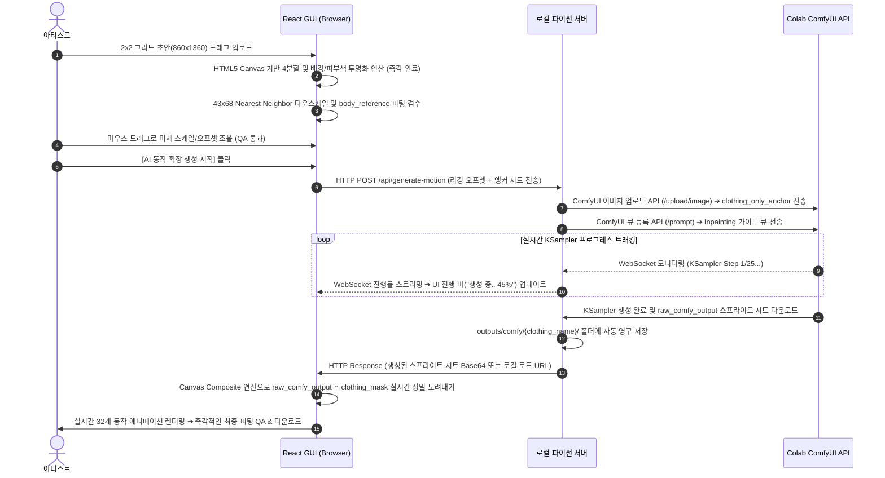

# 🎀 GUI-ComfyUI 통합 실시간 리깅/생성 파이프라인 설계안

본 문서는 React GUI 웹 애플리케이션(`src`)과 로컬 마이크로 백엔드 서버(`scripts/app_server.py`), 그리고 Google Colab의 ComfyUI API를 실시간으로 결합하여 **"디자인 초안 피팅 ➔ 실시간 AI 동작 확장 생성 ➔ 브라우저 내 실시간 모션 QA"**를 완벽하게 통제하기 위한 기술 통합 설계안(Integration Blueprint)입니다.

---

## 1. 시스템 개념 및 아키텍처

기존의 터미널 기반 개별 스크립트 통제 방식을 탈피하고, 아티스트가 **단 하나의 웹 브라우저 화면**에서 모든 생성과 정밀 조율을 완벽히 수행할 수 있도록 **[React GUI (Frontend) ➔ Local Python Server (Agent Proxy) ➔ Google Colab (AI Backend)]**의 3-Tier 하이브리드 토폴로지를 구축합니다.

### 1.1 하이브리드 토폴로지 구성

```txt
┌─────────────────────────────────────────────────────────────────────────────┐
│                            React 웹 앱 (브라우저)                           │
│  - 마우스 드래그 피팅 조율 (X/Y 오프셋, 스케일)                             │
│  - HTML5 Canvas 기반 초안 4분할 & 투명화 (밀리초 단위 로컬 처리)              │
│  - 실시간 프레임 오버레이 & 움직이는 아바타 QA 프리뷰                          │
└──────────────────────────────────────┬──────────────────────────────────────┘
                                       │ (HTTP / WebSocket)
                                       ▼
┌─────────────────────────────────────────────────────────────────────────────┐
│                     로컬 마이크로 파이썬 서버 (Agent Proxy)                 │
│  - FastAPI / Uvicorn 기반 로컬 서버 구동                                    │
│  - 로컬 파일 시스템 제어 (생성된 스프라이트 시트 및 설정을 outputs/에 영구 저장) │
│  - 브라우저 CORS 보안 정책 회피용 API 프록시                                 │
└──────────────────────────────────────┬──────────────────────────────────────┘
                                       │ (Colab URL 터널링 통신)
                                       ▼
┌─────────────────────────────────────────────────────────────────────────────┐
│                          Google Colab (ComfyUI)                             │
│  - 2x2 그리드 의상 앵커를 IP-Adapter 레퍼런스로 주입받음                    │
│  - Inpainting Mask + Canny ControlNet을 통한 고품질 동작 확장 생성          │
└─────────────────────────────────────────────────────────────────────────────┘
```

---

## 2. 왜 로컬 마이크로 파이썬 서버가 필요한가? (Rationale)

React 브라우저 단독으로 Colab ComfyUI와 직접 통신하지 않고, 가벼운 로컬 파이썬 서버(`scripts/app_server.py`)를 중계 프록시로 사용하는 이유는 다음과 같습니다.

1.  **CORS 보안 제약의 원천 해결**: 브라우저에서 외부 ngrok/tunnel 서버로 직접 HTTP/WS 요청을 날릴 때 발생하는 브라우저 고유의 Cross-Origin 차단 정책을 로컬 파이썬 서버가 우회 처리해 줍니다.
2.  **로컬 파일 시스템 자동 저장**: 브라우저는 보안상 사용자 PC 디렉토리에 직접 파일을 쓸 수 없으나, 로컬 서버는 ComfyUI가 생성해 낸 스프라이트 시트를 받아 로컬 개발 폴더(`outputs/comfy/..`) 내에 파일명 계약에 맞춰 자동으로 정형화하여 영구 저장할 수 있습니다.
3.  **성능 최적화의 균형**: 가볍고 정밀한 이미지 처리(예: 마스크 차집합 연산, Nearest Neighbor 리사이징)는 브라우저 단에서 CPU/GPU를 활용해 극도로 빠르게 처리하고, 무거운 통신 및 디스크 I/O는 파이썬 백엔드가 백그라운드로 대행합니다.

---

## 3. 상세 데이터 흐름 및 워크플로우

사용자가 웹 브라우저를 켜고 새로운 의상을 제작하여 에셋을 획득하는 전 과정은 다음과 같은 유기적인 시퀀스로 처리됩니다.



---

## 4. 로컬 파이썬 백엔드 API 명세 (`scripts/app_server.py`)

로컬 서버는 구동 속도가 빠르고 경량인 **FastAPI**를 사용하여 설계합니다.

### 4.1 `POST /api/project/config` (리깅 설정 로드/저장)
*   **용도**: 현재까지 작업한 프레임별 리깅 오프셋 값을 로컬 JSON 파일로 즉시 저장하거나 불러옵니다.
*   **Request Body**: `ProjectConfig` 스키마 데이터.

### 4.2 `POST /api/upload-draft` (2x2 그리드 업로드 중계)
*   **용도**: 아티스트가 올린 초안 파일을 받아서 `outputs/draft/` 경로에 백업 저장합니다.
*   **Response**: 로컬 저장 파일 경로 및 상태.

### 4.3 `POST /api/trigger-generation` (ComfyUI 생성 시작)
*   **용도**: 현재 업로드된 `clothing_only_anchor` 이미지들과 `comfy ui/config.ini`의 colab_url 설정을 읽어, Colab ComfyUI API를 원격 큐잉합니다.
*   **Request Body**:
    ```json
    {
      "clothingName": "Melody_Girl",
      "action": "walk", 
      "comfyUrl": "https://xxxx.ngrok-free.app"
    }
    ```
*   **Response**: 즉각적인 큐 등록 성공 플래그 (이후 실시간 상태는 WebSocket으로 모니터링).

### 4.4 `WS /api/ws/progress` (실시간 WebSocket 프록시)
*   **용도**: ComfyUI API 서버의 WebSocket 스트림을 로컬 파이썬 서버가 포워딩하여 React 브라우저로 실시간 렌더링 진행도(`progress`, `executing` 노드 ID 등)를 전달합니다.

---

## 5. React Frontend 구성 요소 확장 스펙

### 5.1 HTML5 Canvas 기반 로컬 전처리 유틸리티
*   React 단독에서 업로드된 2x2 그리드 이미지를 자르기 위해 `<canvas>` 2D 컨텍스트의 `drawImage(img, sx, sy, sw, sh, dx, dy, dw, dh)` 함수를 활용합니다.
*   **스킨톤 제거 브라우저 연산**:
    ```javascript
    const ctx = canvas.getContext('2d');
    const imgData = ctx.getImageData(0, 0, width, height);
    const data = imgData.data;
    for (let i = 0; i < data.length; i += 4) {
      const r = data[i], g = data[i+1], b = data[i+2];
      // MASK_SPEC 스킨톤 기준 감출 시 알파 채널 0 투명화
      if (r >= 220 && g >= 150 && g <= 255 && b >= 80 && b <= 240 && r >= g && g > b) {
        data[i+3] = 0; // Alpha = 0
      }
    }
    ctx.putImageData(imgData, 0, 0);
    ```
*   **Nearest Neighbor 축소 연산**: Canvas CSS 스타일 `image-rendering: pixelated` 또는 오프스크린 픽셀 맵 복사를 강제 처리하여 정밀 보정된 `43 × 68` px 도트 앵커를 100% 브라우저 순수 메모리 연산으로 완성합니다.

### 5.2 실시간 생성 진행도 및 WebSocket UI 위젯
*   Step Progress 컨트롤러 우측에 **"ComfyUI API 연동 위젯"**을 추가합니다.
*   진행 바(`ProgressBar`)와 함께 현재 어느 KSampler 단계(`"KSampler: Step 14/25 (56%)"`)를 연산 중인지 텍스트로 시각적으로 시원하게 노출하여 대기 시간을 시각적으로 즐겁게 연출합니다.

### 5.3 브라우저 실시간 마스크 가공 및 애니메이션 렌더링
*   ComfyUI가 반환해 준 `raw_comfy_output` 이미지가 로드되는 순간, 브라우저 Canvas에서 미리 준비된 `clothing_mask` 이미지를 배경으로 깔고 `globalCompositeOperation = 'source-in'` 연산을 1프레임만에 실행합니다.
*   바디가 도려진 **`clothing_only_candidate`**를 획득하여, 현재 재생 중인 캐릭터 스프라이트 위에 오프셋 보정값과 함께 얹어 **그 어떤 도트의 밀림 현상이나 지연 시간 없이 60fps로 매끄럽게 피팅 모션을 렌더링**합니다.

---

## 6. 개발 및 순차적 구현 로드맵 (Roadmap)

본 통합 파이프라인의 완성은 다음 4단계에 걸쳐 리스크 없이 안전하고 완벽하게 구축됩니다.

*   **Phase 1: 로컬 마이크로 파이썬 서버 기반 확립 (`scripts/app_server.py` 개발)**
    *   FastAPI 기반 뼈대 세팅, CORS 우회 프록시 및 기본 로컬 파일 디스크 저장 기능 테스트 완료.
*   **Phase 2: React 브라우저 이미지 고속 전처리 유틸리티 개발**
    *   2x2 그리드 슬라이서, HTML5 Canvas 기반 고속 스킨톤 제거 및 Nearest Neighbor 다운스케일 모듈 통합.
*   **Phase 3: ComfyUI HTTP/WS API 클라이언트 중계 연동**
    *   로컬 서버에서 Colab ComfyUI로 파일 업로드, 큐 덤프, WebSocket 프로그레스 데이터를 중계 스트리밍하는 파이프라인 무결성 확보.
*   **Phase 4: 전체 GUI 마법사 연동 완료 및 모션 프리뷰 실시간 QA 검증**
    *   React UI에 로딩 스피너 및 프로그레스 뷰어 탑재, 최종 에셋 렌더링의 바디 ∩ 마스크 연산 실시간 처리 무결성 검수.
